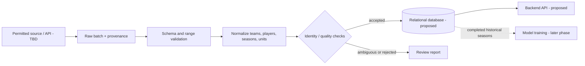

# Data pipeline and model data contract

**Status:** design plan; there is no implemented pipeline, database, or dataset in the inspected repository. `data_analysis/src/data/load_data.py` and `data_analysis/data` are empty. Source coverage and rights must be checked before use.

## Sources and required datasets

| Source | What is known | Status / next check |
| --- | --- | --- |
| CollegeBasketballData.com (CBBD) [player season statistics](https://api.collegebasketballdata.com/api/stats) | The official API documents `/stats/player/season`; the provider's [availability page](https://api.collegebasketballdata.com/data-availability) lists player box-score/season statistics from **2003–present**. Existing frontend code references this endpoint. | **Published endpoint/range verified; actual men's DI records, field completeness, and this key's access still untested.** |
| CBBD [team statistics](https://api.collegebasketballdata.com/api/stats) | Published availability lists team season records/scoring totals from **1949–present**, but detailed team box-score statistics from **2003–present**. | **Published ranges verified; field and division coverage still need a sample audit.** |
| CBBD [transfer portal](https://api.collegebasketballdata.com/api/recruiting) | Published availability lists portal records from **2021–present**; destinations and player details may be incomplete. | **Published range verified; linking to men's DI player stats and record completeness remain TBD.** |

The broad statement that CBBD has statistics “from 2000” is not a reliable range for every field: published player-season statistics start in 2003, while team records extend earlier. The provider's [terms](https://collegebasketballdata.com/terms) permit private caching and model training subject to access limits, but forbid exposing the key or redistributing raw data as a bulk dataset. Confirm the account's endpoint entitlement and usage limits before importing. The current source key is embedded in frontend code and needs rotation and server-side storage.

**Confirmed desired coverage:** men's NCAA Division I candidates and destination teams for 2022–23 through 2026–27, inclusive. DII candidates are outside the first version. CBBD uses the season-ending year (`season=2023` for 2022–23; `season=2027` for 2026–27). Verify actual DI records for each season; a published range does not guarantee every player or field. The 2026–27 season is not a completed historical outcome as of 2026-10-08 and cannot be used as a final label until it concludes. [CBBD availability notes](https://api.collegebasketballdata.com/data-availability).

For the first working app, seek men's DI player-season records plus reliable team identifiers and candidate-status information where available. For the later model, seek multiple **completed** DI-to-DI transfer seasons with pre-transfer records, transfer destinations, post-transfer player outcomes, and destination-team outcomes. Exact usable seasons, completeness, and minimum sample size are **TBD** after a coverage audit; reserve a later completed season for final evaluation.

## Ingestion and updates (Proposed)

1. Record source, usage rights, field definitions, season coverage, and retrieval timestamp before importing.
2. Start with a manually triggered import for one season. Keep the raw response/file immutable for reproducibility where storage rights permit.
3. Parse to a staging table or equivalent intermediate records; validate required fields, types, ranges, season formats, and denominators.
4. Normalize team IDs and names, conference, player source IDs, positions, seasons, and statistic units. Validate that included teams are DI for the relevant season; keep raw values and transformation notes.
5. Resolve duplicate or conflicting player records using source IDs plus team/season context; queue ambiguous matches for manual review. Never merge by name alone.
6. Upsert validated records using stable natural/source keys and an import batch ID. Preserve existing good records if a new batch fails.
7. Produce an import report with fetched, accepted, updated, duplicate, rejected, and unresolved rows, plus examples of validation errors.
8. After manual import is reliable and source terms permit it, **Proposed:** schedule refresh at a cadence matching the source. Alert on failures and significant row-count changes.

## Missing, duplicate, and inconsistent data

- Store missing values as missing, with a reason when known; do not convert absent statistics to zero.
- Keep games and minutes denominators so rates can be compared correctly. Decide minimum sample thresholds with coaches.
- Distinguish a player who did not appear in a source from a player with a recorded zero.
- Detect exact duplicates by source ID, season, and team. Flag cross-source disagreements for review rather than silently choosing one.
- Maintain an internal player ID and a mapping to each source's identifier. Name changes, spelling variants, and same-name players require reviewable matching rules.
- Reject impossible seasons, negative counts, contradictory transfer dates, or post-decision fields in pre-transfer feature snapshots.

## Storage, validation, and operations

The proposed relational entities and keys are in `project-overview.md`. Keep `import_batch` metadata, source timestamps, record-level lineage, and a validation report. Apply imports transactionally or through staging so partial failures do not leave a mixed season. Make reruns idempotent. Define retention and deletion for raw data and private notes after source terms and deployment are chosen.

Start with manual runs and a simple error report. A scheduler, queue, or distributed processing system is unnecessary until source volume and refresh needs justify one. Failure handling should include safe retry for transient requests, a clear stop for schema changes, and a visible batch status.

## Define the prediction before collecting model features

**Confirmed success concepts:** (1) personal success means the player plays better after transferring; (2) team success means the DI destination team improves. Keep these as separate outcome questions. Neither is an operational label yet. **TBD:** the metric and baseline for “better,” the team improvement measure, the horizon (for example, the first post-transfer season), and injury/redshirt/incomplete-season rules. A team improving does not by itself prove that the transfer caused it.

Possible personal measures include role-adjusted playing time or efficiency improvement relative to a pre-transfer baseline; possible team measures include improvement in a chosen team statistic relative to its prior season. These are examples for discussion, **not approved targets**. Decide whether the first model predicts one primary outcome or reports two separately after data feasibility is known.

**Confirmed annual prediction moment:** after the final game of the men's NCAA Division I tournament (March Madness). Record that game's final time as each cycle's cutoff. “Use all the stats now to predict the future” means use relevant statistics **available by that cutoff**, including completed games up to that point, not data published or corrected afterward. Preserve an as-of snapshot for each historical training case; season aggregates created later may need reconstruction or exclusion. Post-transfer minutes, destination-team results, and later scouting notes must never enter training features. The outcome horizon remains **TBD**.

## Minimum historical transfer record to seek

- Stable player identifier and source identifiers, with a reviewed transfer-to-destination match.
- Origin and destination team, transfer season, and dates or cutoff rules.
- Pre-transfer season statistics with games and minutes as denominators, position/role, age/class if legally and reliably available, and source timestamps.
- Destination-season player observations and destination-team baseline/outcome observations needed to calculate the two approved success labels, if both prove feasible.
- Missingness, cancellations, injuries, and eligibility status where reliable and permitted.
- Source name, license or access terms, extraction date, and transformation history for each field.

Check whether a source covers both successful and unsuccessful transfers; a list of prominent transfers alone will bias the model.

## Later modeling sequence (Proposed)

1. Audit record linkage, missing values, label prevalence, season coverage, and obvious leakage.
2. Create an interpretable baseline (for example, a regularized logistic model) and compare it to simple coach-friendly rules.
3. Split evaluation by time: train on earlier transfer seasons, tune on a later season, and reserve the newest complete season as an untouched test set. Keep all records for a player in the same split.
4. Report discrimination, precision/recall at practical shortlist sizes, calibration, and performance by relevant subgroups and seasons. Include confidence intervals where sample size allows.
5. Calibrate predicted probabilities, document missing-data behavior, and set a minimum evidence threshold before any prediction is shown.
6. Version the training data, label rule, feature list, model, and evaluation report. Monitor drift and outcomes after deployment.

No performance claims or probability thresholds should be selected before real labeled data is evaluated.

## Coach-facing interpretation

Show the outcome and horizon in plain language, the relevant pre-transfer evidence, important missing data, and the date/model version. Provide comparisons and uncertainty. Avoid suggesting that the score is a causal effect of transferring to a specific team unless the model and data actually support that claim.

## Security and governance gates

- Rotate the credential currently embedded in frontend source and move future API access behind a backend secret store.
- Verify data licensing and permitted downstream uses before importing or publishing third-party records.
- Limit access to private coach notes and team strategy; define retention and deletion rules.
- Log data imports and model versions so predictions can be reproduced and reviewed.
