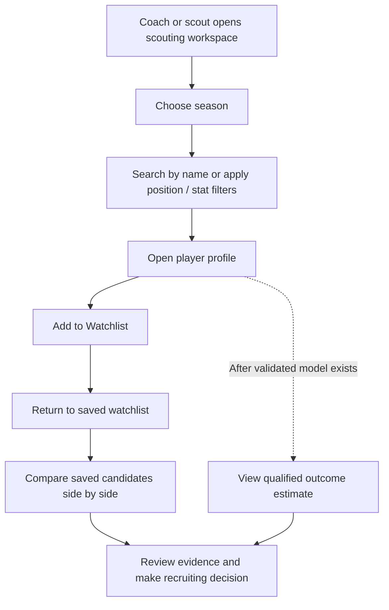
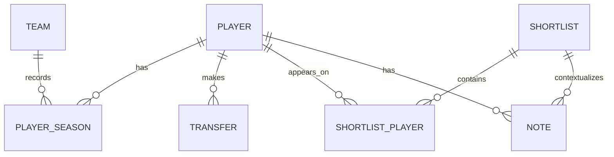
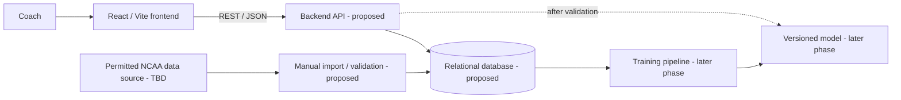

# NCAA Basketball Analytics and Transfer Performance Prediction: project overview

**Status:** planning document. Existing implementation is a Vite/React shell; everything labeled **Proposed** below is a design to review, not an implemented feature. See `progress.md` for verified progress.

## Purpose and users

**Problem:** Coaches need to discover and compare recruiting candidates using statistics from different teams and seasons, incomplete context, and subjective scouting notes. A single score cannot make the recruiting decision for them.

**Goal:** Build a decision-support workspace where a coach can discover players, evaluate performance, compare candidates, and organize watchlists. After a post-transfer outcome and historical dataset are validated, add a qualified performance estimate with uncertainty and supporting evidence. This is also the owner's personal learning project across full-stack engineering, data engineering, system design, and machine learning.

**Guiding question:** “Which player should our team consider recruiting, and how likely is that player to perform well after transferring?”

**Project priorities:** (1) Scouting through discovery, evaluation, comparison, and watchlists; (2) machine learning to estimate post-transfer performance only when a target and real historical evidence support it. The coach makes the final decision.

**Target users (Confirmed):** men's college basketball coaches and scouts recruiting for **NCAA Division I teams**. The first version searches **DI men only**; DII candidates are outside the current scope and may be reconsidered later. The requested season range is **2022–23 through 2026–27, inclusive**. Candidate eligibility or portal-status source and whether the first release serves one or multiple staffs are **TBD**. This season range is a product coverage goal, not proof that every source covers it; 2026–27 cannot supply a completed outcome label until that season ends.

**Success direction (Confirmed, not yet measurable):** Personal success means the player plays better after transferring; team success means the destination team improves. These are two distinct outcomes. The annual prediction cutoff is **after the final game of the men's NCAA Division I tournament (March Madness)**. Use relevant statistics available by that point to predict later performance; future or post-transfer observations cannot be training inputs. Exact metrics, baselines, outcome horizon, and whether either outcome is the first model target are **TBD**. For historical examples, a season's pre-cutoff data must be paired with an outcome from a later season, without using data published after the cutoff as an input.

## Primary workflow

1. A coach searches by player name or applies position and statistical filters within the selected season and competition.
2. The coach opens a player profile to review season-by-season offensive/defensive statistics, source, and missing data.
3. The coach selects **Add to Watchlist**, then compares two or more saved candidates side by side. The saved watchlist remains after refresh.
4. Once a validated model is available, the coach sees an estimated probability, uncertainty, and the factors affecting the estimate.
5. **Later enhancement:** the coach exports a decision brief with evidence, notes, and model version if applicable.

## MVP features (Proposed)

- NCAA Division I men's players and recruiting destinations; seasons 2022–23 through 2026–27.
- Player discovery by name with position, team, conference, season, and available-statistic filters; show data coverage.
- Player profiles with season-by-season offensive/defensive metrics, source/update information, and private scouting notes.
- A persistent watchlist and side-by-side comparison of 2–4 players using consistent measures.
- Saved team needs (positions and desired characteristics) usable as transparent discovery filters.
- A clear distinction between observed statistics and model output, with predictions unavailable until a real historical dataset, target definition, and holdout evaluation are approved.
- A repeatable, manually triggered import with missing/invalid/duplicate record reporting for permitted data. An admin UI is optional for the first local version.

**Nice-to-haves (Proposed):** calibrated post-transfer performance prediction with uncertainty and supporting evidence; team-specific fit (only if supporting data exists); advanced charts and exportable scouting summaries; scheduled refresh and staff collaboration; possible DII candidate expansion after the DI workflow and data quality are proven. Automated outreach, scholarship/eligibility advice, and public rankings are outside the initial scope.

## User flow (Proposed)

## Core data structures and schema (Proposed)

Use stable internal IDs and keep source IDs separately so mismatched names do not merge players. The first relational schema can be:

| Entity | Key attributes | Relationship / constraint |
| --- | --- | --- |
| `team` | `id`, `name`, `conference`, `competition`, `season` | A team has many player-season rows. Season-specific identity avoids silent team changes. |
| `player` | `id`, `display_name`, `source_player_id`, `source_name` | A player has many season rows and potentially multiple transfers; source ID plus source is unique when available. |
| `player_season` | `id`, `player_id`, `team_id`, `season`, `position`, `games`, `minutes`, agreed statistical fields, `source_updated_at` | Unique player/team/season/source record; all rates retain denominators. |
| `transfer` | `id`, `player_id`, `origin_team_id`, `destination_team_id`, `transfer_season`, `decision_cutoff`, `status` | Destination and outcome may be unknown at recruiting time; avoid using them as model inputs. |
| `shortlist` | `id`, `name`, `season`, `team_context` | Proposed storage name for a coach's saved watchlist; has many players through `shortlist_player`. Owner/workspace ID is needed if multiple staffs use the app. |
| `shortlist_player` | `shortlist_id`, `player_id`, `added_at` | Unique shortlist/player pair. |
| `note` | `id`, `player_id`, `shortlist_id`, `body`, `created_at` | Private coach observations; access rules are **TBD**. |
| `import_batch` | `id`, `source`, `retrieved_at`, `row_count`, `rejected_count`, `status` | Provides provenance and validation history. |

`prediction` (`player_id`, `model_version`, `outcome_definition`, `probability`, `created_at`) is **Proposed for the later ML phase**. Exact statistic columns, team context, authentication model, and data retention are **TBD**.

## REST API design (Proposed, not implemented)

All responses are JSON. Use consistent pagination and errors such as `{error: {code, message}}`; do not expose upstream API credentials. IDs are internal IDs. The exact authentication mechanism is **TBD**.

| Method and endpoint | Request | Response |
| --- | --- | --- |
| `GET /api/players` | Query: `season`, optional `position`, `team`, `conference`, `search`, agreed statistic bounds, `page`, `page_size` | `{items: [DI player summaries], page, total, coverage}` with source/missingness indicators. |
| `GET /api/players/{player_id}` | Path: `player_id` | Player identity, transfer context, season stats, provenance, missing fields. |
| `GET /api/shortlists` | Optional `season`; user-facing name is watchlists | `{items: [saved watchlist summaries]}`. |
| `POST /api/shortlists` | Body: `{name, season, team_context}` | `201` and created shortlist. |
| `GET /api/shortlists/{id}` | Path: shortlist ID | Shortlist and candidate summaries. |
| `PUT /api/shortlists/{id}` | Body: `{name, team_context}` | Updated shortlist and team-needs priorities. |
| `PUT /api/shortlists/{id}/players/{player_id}` | Path IDs | Updated membership; idempotent. |
| `DELETE /api/shortlists/{id}/players/{player_id}` | Path IDs | `204` on removal. |
| `GET /api/players/{player_id}/notes` | Path: player ID | `{items: [notes]}` for authorized workspace. |
| `POST /api/players/{player_id}/notes` | Body: `{shortlist_id?, body}` | `201` and created note. |
| `GET /api/imports/{id}` | Path: import batch ID | Counts, source, timestamp, validation errors. |
| `POST /api/predictions` | **Later ML phase:** player and decision context | Outcome, horizon, probability, limitations, model version, input completeness. Never enabled before validation. |

Validation errors, `404` for unknown IDs, and authorization errors should follow a consistent structure. Import trigger endpoints, if needed, should be restricted and designed after the ingestion workflow is chosen.

## Tech stack and architecture

- **Existing:** React and Vite provide the frontend scaffold. React Router is installed, but the inspected app does not use routes or render a coach workflow.
- **Proposed backend:** a small Python REST API, so ingestion and later ML can share a language. Framework choice is **TBD**; keep third-party credentials on the server.
- **Proposed storage:** a relational database for player identity, season data, transfers, shortlists, notes, and provenance. Start with a simple local option; production database choice is **TBD**.
- **Proposed pipeline:** manually triggered, validated imports first; schedule only after source terms and update cadence are known.
- **Proposed ML:** Python model training and a versioned artifact after the label and dataset are validated. No model is currently present.
- **Proposed access:** authenticated staff workspaces before real private notes or multi-staff use. Exact approach is **TBD**.

## MVP acceptance scenarios

- Given a player database, searching by name returns matching players with season and division context.
- Given position and statistical filters, applying them returns only matching records.
- Given a player profile, selecting **Add to Watchlist** saves that player.
- Given at least two saved players, selecting **Compare** shows their statistics side by side on consistent measures.
- Given a saved watchlist, refreshing the page leaves its players available.
- A coach can see the exact season and source of each statistic, add a note, and see when a measure is missing or not comparable.
- An administrator can inspect rejected import rows and correct source data without silently changing player identities.
- A prediction, when enabled, includes outcome definition, model version, evaluation summary, and an explanation of missing inputs.
- The app never presents an unvalidated or synthetic estimate as a real recruiting probability.

## Decisions and immediate next steps

**Confirmed:** This is a personal learning project; the owner writes core functionality unless they explicitly ask for implementation. Both the first candidate pool and recruiting destinations are men's NCAA Division I; seasons 2022–23 through 2026–27 are the desired coverage; users are coaches and scouts. The first use case is name search → profile → watchlist → comparison. Personal and team success are distinct desired outcomes. Predictions use data available after that season's final men's DI tournament game. Coaches make the recruiting decisions.

**TBD:** precise personal and team success metrics, baselines, and post-transfer horizon; actual DI source coverage, access entitlement, and verified transfer eligibility; private single-staff versus multi-staff access. These decisions affect the schema and evaluation.

Next: make the two success concepts measurable, verify DI records in the chosen source, and rotate the exposed credential before API work. Then review the smallest schema exercise in `progress.md`. See `data-pipeline.md` for data/model constraints.
